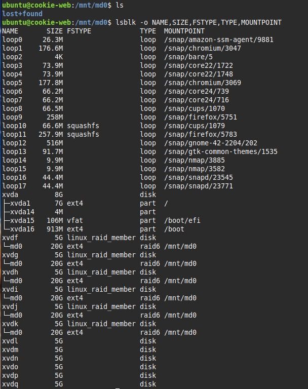

<h1>Alec Porter Tast 1 - RAID Management</h1>
<h2>Built It</h2>
I created 12 5GiB volumes to work with in my Amazon instance:


I had an existing 4 disk RAID 6 I built in class...time to nuke it 💥!<br>
First, unmount the array ```sudo umount /dev/md0```.<br>
Second, update the /etc/fstab file ```sudo vim /etc/fstab``` and comment out the line that mounted the array on start up.<br>
Third, stop the array ```sudo mdadm --stop /dev/md0```.  I received verification that the array was stopped: mdadm: stopped /dev/md0.<br>
Fourth, Reboot and remove the array ```sudo mdadm --remove /dev/md0```:


Fifth, remove superblocks from each disk in the old array ```sudo mdadm --zero-superblock /dev/xvdf /dev/xvdg /dev/xvdh /dev/xvdi```.  This keeps them from being reassembled into a future array. Because I had to reboot the instance I also had to rerun the stop command.  I'm not sure if there is a different order I could have used or a way to remove the array without rebooting but after checking several examples online, they all were in the order stop array, remove array, and remove superblocks:


I ran ```cat /proc/mdstat``` to verify I now longer had an array.  I have 12 disks ready to build an array. I'm going to build a new RAID 6 array using 6 disks for a massive 20TiB array with 2 disk resiliency.<br>
The command ```sudo mdadm --create --verbose /dev/md0 --level=6 --raid-devices=6 /dev/xvdf /dev/xvdg /dev/xvdh /dev/xvdi /dev/xvdj /dev/xvdk``` builds the array.  /dev/md0 is the name of the RAID array, level-6 is the RAID level, and raid-devices=6 is the number of disks in the array followed by the device location of each disk.


The advantage of small disk sizes is that the array builds really fast.  Running ```sudo mdadm --detail /dev/md0``` shows that the status of the array. I verified there was a new device in the /dev folder and with lsblk.


The next step is to create a filesystem on the array ```sudo mkfs.ext4 /dev/md0```, create a mount point ```mkdir /mnt/md0``` and mount the array with ```sudo mount /dev/md0 /mnt/md0```.  Everything looks good at this point:



...until I need to restart and the array isn't mounted.  Time to edit /etc/fstab and add the following line ```/dev/md0        /mnt/md0        ext4    defaults 0 1```.  Running ```mount -a``` verifies that fstab is configured correctly (-a mounts all filesystems mentioned in fstab).<br>

<h2>Detect It</h2>

There are two command I can use to check the status of the array: ```mdadm --detail /dev/md0``` and ```cat /proc/mdstat```.  The --detail command shows each disk and will indicate if there is a faulty disk.  /proc/mdstat indicates active disks with the "U" and if a disk is faulty it will change to a "_".


Let's 💔 some 💩!<br>

<h3>Break It</h3>
I detatched disk01 from my instance.  I can use lsblk and verify that /dev/xvdf is no longer listed.


Running ```mdadm --detail /dev/md0``` and ```cat /proc/mdstat``` shows that /dev/xvdg has been removed:


mdadm --detail shows that state of the array as degraded.   With a RAID 6 configuration I detach one more drive and still recover data.  To fix the array I added a new drive to the array using the command ```sudo mdadm --manage /dev/md0 --add /dev/xvdl``` with /dev/xvdl being the new drive.  To check the rebuild status I can use both the --detail command or view the /proc/mdstat:


The array is currently being rebuilt.  I gave it a bit of time and checking the status shows a new drive has been added to the array and the array is back in good order.  The array rebuild took less than two minutes.  With larger disks and data on the disks, the rebuild will take longer (many, many hours for large disks with a lot of data).  I detached two disks, reattached the first drive, and rebuilt the array. I was still able to access a text file I saved on the array.  I then detached three disks and the array showed as failed instead of degraded.  Interestingly enough I could still access the file I created on the array so I rebooted the instance.  After the reboot the array showed as inactive and I couldn't access the file which is what I expected after detaching the devices.<br><br>
I reattached the drives and looked at the array.  It showed all six drives but the array was inactive.  I know (at least for ZFS) that you can remove a drive and if you don't change any data on it you can add it back to the array without issue (very nice if you pull the wrong drive because you aren't great at tracking where all the drives are in the case by serial number).  It looks like you can use the --re-add command to do that in mdadm but I was unsuccessful.  I tried a variety of commands (--re-add, --reassemble, etc.) to see if I could recover any data.  What I think is happening is that the reattached disks still contain superblock data but the act of detaching and reattaching does something to the disk so it can't just be re-added.  That's why tutorials recommend running the command to remove superblocks prior to building a new array if you use disks that could have been part of an old array.  I felt that array was sufficiently broken so time to 💥 it!!!!!!<br><br>
Reading a bit more on mdadm, there is a command to remove a drive from the array ```mdadm --manage /dev/sdX --remove /dev/sdX```.  If the disk is still in the system you need to mark it as failed using the command ```sudo mdadm --manage /dev/md0 --fail /dev/sdX``` otherwise you will get an error message that hot remove failed for the device because the resource is busy. I built a new RAID 6 array only to find out that when you detach a drive it is no longer physically recognized by the system so the commands --fail and --remove give me an error ```mdadm: stat failed for /dev/xvdq: No such file or directory```.<br><br>
For a physical system where you detect a drive is failing you need to mark it as --fail then --remove it before --add a new drive and rebuilding the array.  If the drive is no longer recoginzed by the system (something failed bad enough and the device is no longer int /dev or listed in lsblk) or was already removed then you can just --add.  Some websites outlined copying the partition table form one of the good disks to the new disk you will add to the array but I received an error message that the disk I selected did not contain a recognized partition table.  All of the times I added a replacement disk to the array I had no issues without coping a partition table.  Using fdisk -l on all devices I discovered that none of the drives in the mdadm created array had a disklabel type or a disk identifier, but all of the disks in the ZFS pool (see below) had a gpt disklabel type and a diskidentifier value.

<h2>Just For Fun</h2>

Just to give it a try, I installed ZFS on my instance ```sudo apt install zfsutils-linux``` and build a raidz2 array (similar to RAID 6) using ```sudo zpool create tank raidz2 /dev/xvdf /dev/xvdg /dev/xvdh /dev/xvdi /dev/xvdj /dev/xvdk```.  Because ZFS is filesystem, volume manager, etc. all-in-one I now have a pool called tank in my root directory without the need to format, mount, and edit fstab.


I detached three disks just like I did with mdadm and ZFS had an interesting status output.  The pool showed degraded and the pool was also suspended which means there is a device connection issue.  I could still access data and only two of the three drives were showing as removed but the thrid drive that was detached showed as online but was experiencing read/write errors.  


Rebooting the instance brought the zpool down just like with the RAID array but after reattaching the drives and rebooting the zpool was back to showing all six drives online.  It did show 2 checksum errors so randomly detaching and attaching drives and rebooting a bunch isn't good for the health of the filesystem.  ZFS has the abilibity to try and recover from errors or corruption by running a scrub.  The scrub examines all data and replaces corrupted data with good data using redundant data.  I'm not sure why I could access data even after detaching three drives on systems running dual resiliency arrays/pools.  I have real hardware I could test with but I'm not pulling and reinserting spinning hard drives just out of curiosity 😆...<br>

One of keys to managing an array either with mdadm or ZFS is to have a good log of your device names (sda, etc.), their UUIDs, serial numbers, and where they are located in the chassis or which hotswap bay they are in.  When using mdadm. ideally you mark a disk as failed first, remove the failed disk from the array, physically remove the disk, physically install a new disk, then add the new disk to the array and wait for the array to rebuild.  ZFS differs in that you don't need to mark a disk as failed, but you basically follow the rest of steps outlined with mdadm and for some reason rebuilding a ZFS array is know as resilvering (which sounds cool).
