<h1>Syncthing (syncthing.net)</h1>
<h2>Documentation: https://docs.syncthing.net/index.html</h2>
From the website:
“Syncthing is a continuous file synchronization program. It synchronizes files between two or more computers in real time, safely protected from prying eyes. Your data is your data alone and you deserve to choose where it is stored, whether it is shared with some third party, and how it’s transmitted over the internet.”
<h3>Hardware Requirements</h3>
Syncthing only synchronizes files so there are minimal hardware requirements.
<h3>Creating AWS Instance</h3>
<ul>
<li>Created new VPC with IP address 10.0.2.0/24 titled my-hosts-vpc</li>
<li>Created a subnet for my-hosts-vpc titled my-hosts-subnet</li>
<li>Created internet gateway titled my-hosts-gateway</li>
<li>Attached my-hosts-gateway to my-host-vpc</li>
<li>Created a route table titled my-hosts-routetable for my-hosts-vpc</li>
<li>Edited subnet associations to ensure the subnet will use the routetable</li>
<li>Edited routes to create an internet gateway for my-hosts-vpc to communicate to the internet</li>
</ul>
<h3>Security: Network ACL</h3>
<ul>
<li>Created a network ACL for my-hosts-vpc title my-hosts-network-acl</li>
<li>Associated my-hosts-network-acl with a my-hosts-subnet</li>
<li>Edited inbound rules: Initially allow all traffic from any source to come in</li>
<li>Edited outbound rules: Initially allow all traffic out no matter its destination</li>
</ul>
<h3>Security: Security Group Inbound Rules</h3>
<ul>
<li>SSH / TCP / 22 / My IP / 174.103.149.15/32</li>
<li>Custom TCP / TCP / 22000 / My IP / 174.103.149.15/32</li>
<li>Custom UDP / UDP / 22000 / My IP / 174.103.149.15/32</li>
<li>Custom UDP / UDP / 21027 / My IP / 174.103.149.15/32</li>
<li>Custom TCP / TCP / 8384 / My IP / 174.103.149.15/32</li>
<li>Same four rules for IP address at WSU (130.108.0.0/16)</li>
<li>Reference: https://docs.syncthing.net/users/firewall.html</li>
</ul>
<h3>Security: Gecurity Group Outbound Rules</h3>
<ul>
<li>Allow all outbound traffic, if I generated the request I am fine with traffic moving out.</li>
</ul>
<h3>Create Instance</h3>
<ul>
<li>Created new ed25519 key pair</li>
<li>Created new instance of Ubuntu t.2small with 32GB of drive space. Selected my VPC, subnet, and the security group</li>
<li>Allocated an elastic IP address and then associated it with my Ubuntu instance</li>
<li>Ubuntu instance IP address: 35.168.182.166</li>
<li>Change permissions on the key using chmod 600</li>
<li>SSH into my Ubuntu instance: ssh -i /home/alec/keys/my-hosts-key.pem ubuntu@35.168.182.166</li>
</ul>
<h3>Install Syncthing</h3>
References:<br>
https://docs.syncthing.net/intro/getting-started.html<br>
https://www.atlantic.net/dedicated-server-hosting/how-to-install-syncthing-on-ubuntu-22-04/<br>
Used the following commands to install Syncthing:<br>

```sudo apt update``` <br>
```sudo apt upgrade``` <br>
```sudo apt install syncthing``` <br>
```syncthing –version``` <br>
Check status of service: ```systemctl status syncthing@root.service``` <br>
Enable service: ```sudo systemctl enable syncthing@root.service``` <br>
<h3>Running Syncthing</h3>

Time to test if we can access Syncthing. To run Syncthing, type `syncthing` from the command line. Navigate to http://35.168.182.166:8384. 

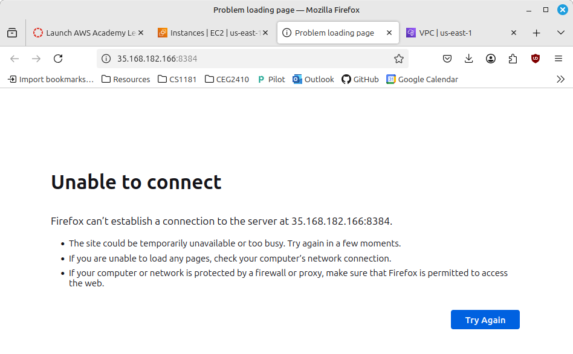

We can’t access the web GUI…is it even running? Lets try Lynx, a command line browser. Yes, there is a webpage on port 8384 running on localhost/127.0.0.1 but how do we access it from a remote maching? 

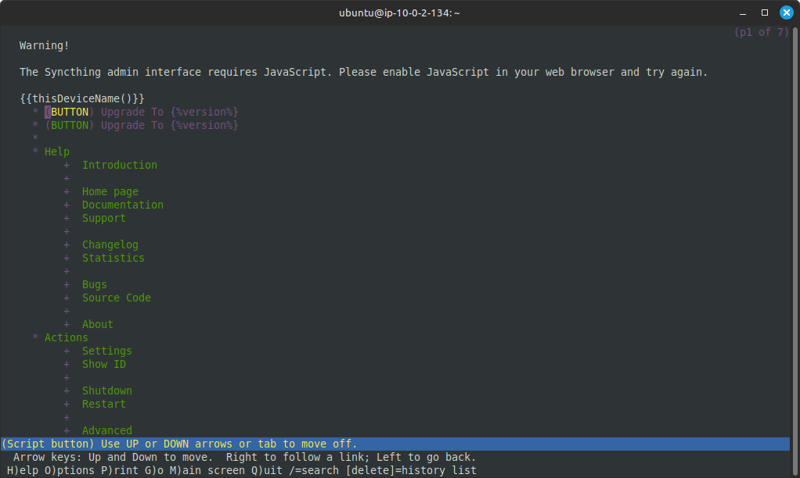

We can edit the configuration file to change the web GUI ip address. To determine where the configuration file is located type `syncthing –paths`.

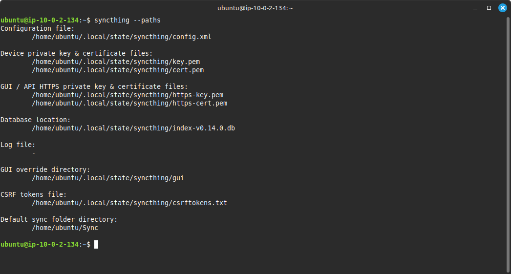

Before we edit config.xml, create a back up. We need to change the listen address so a different computer can access the web GUI. Similar to the firewall, changing the listening address to 0.0.0.0:8384 will allow any computer access to the web GUI. Changeing the IP addess to 0.0.00:8384 will have some security implications but our security group only allows connections from certain IP addresses to help address that security concern. Reference: https://docs.syncthing.net/users/guilisten.html. After updating the config.xml and restarting Syncthing...success! Technically we can ocnfigure Syncthing using only the configuration files but it is much easier to use the web GUI.

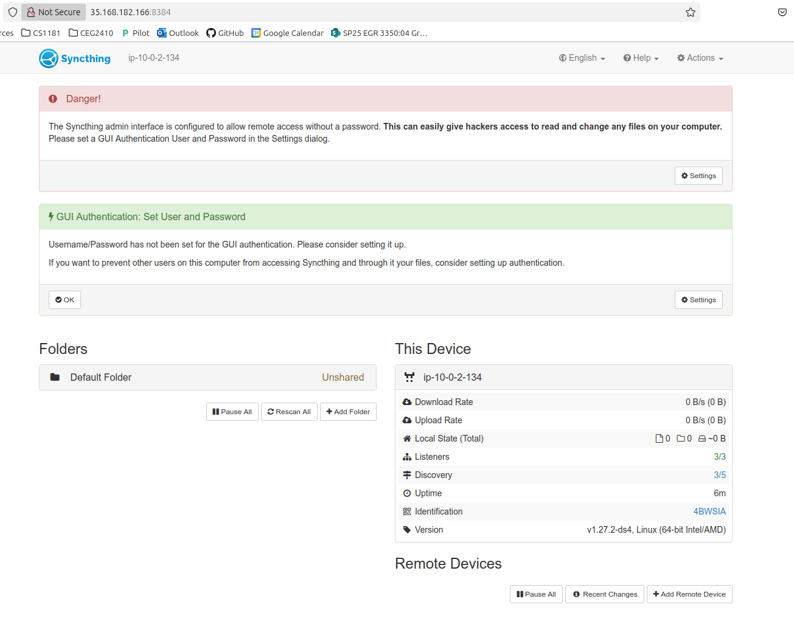

For an added layer of protection, let’s set the user name and password for the GUI and enable https by clicking on settings. I can now access the web GUI from hame and school.

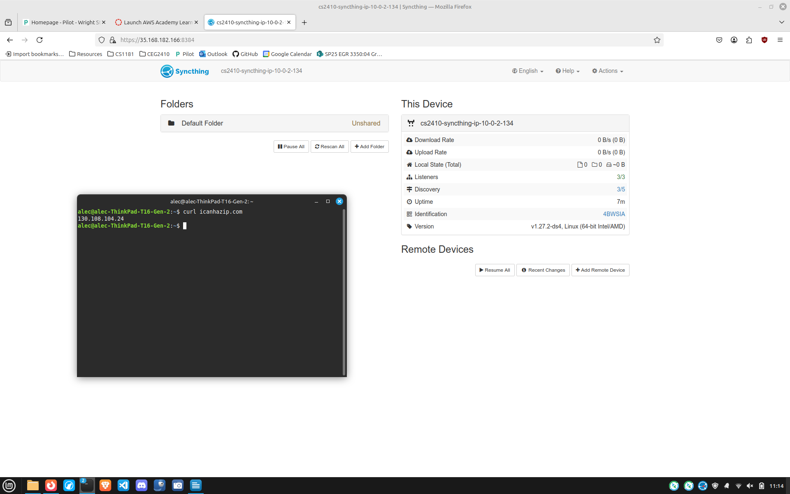

The issue we now have is that we need to start Syncthing when the server starts. In the /etc/systemd/user folder: `sudo wget https://raw.githubusercontent.com/syncthing/syncthing/refs/heads/main/etc/linux-systemd/system/syncthing%40.service`. Enable and start the service: `sudo systemctl enable syncthing@ubuntu.service` then `systemctl start syncthing@ubuntu.service`. After a quick reboot Syncthing starts automatically. Reference: https://docs.syncthing.net/users/autostart.html.<br>
<h3>Setup to Synchronize Folders</h3>
Click on "Add Folder" under Folders. Provide a folder label and folder path ~/synch-folder-1. Use the absolute folder path (~ is accepted as path to home folder). Click Save.

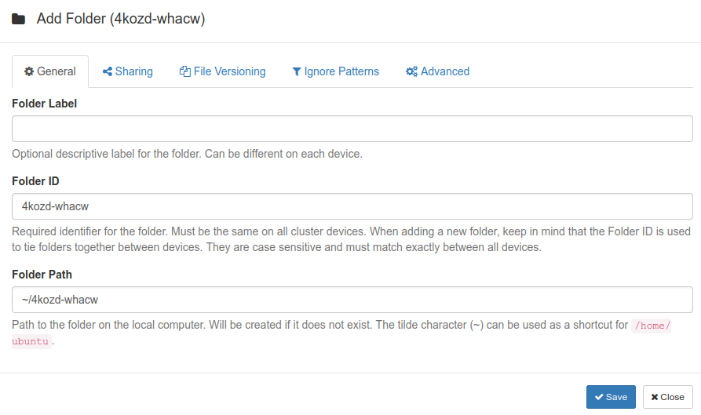

Install Syncthing on remote device. From the host web GUI, click on Add Remote Device. You can select nearby devices if they are listed or enter the device ID (Actions -> Show ID in upper right corner of remote device web GUI). Give the device a recognizable name. Under Shearing tab, select folder(s) to share and give the folder(s) a reognizable title. Introducer lets a device automatically add new devices. Leave this blank to start off with. Here are details on what it does: https://docs.syncthing.net/users/introducer.html. Click save.

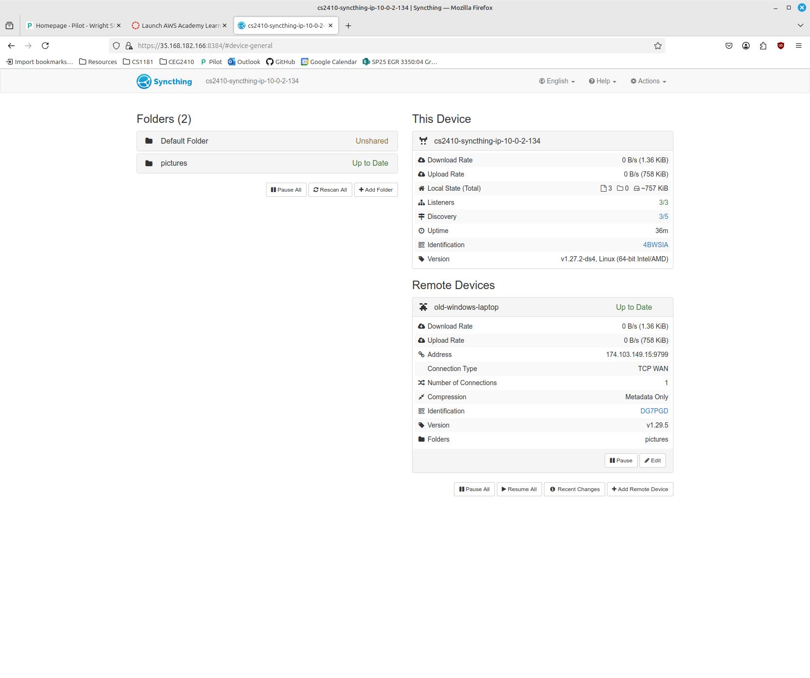

On the remote device you should see a message pop up:

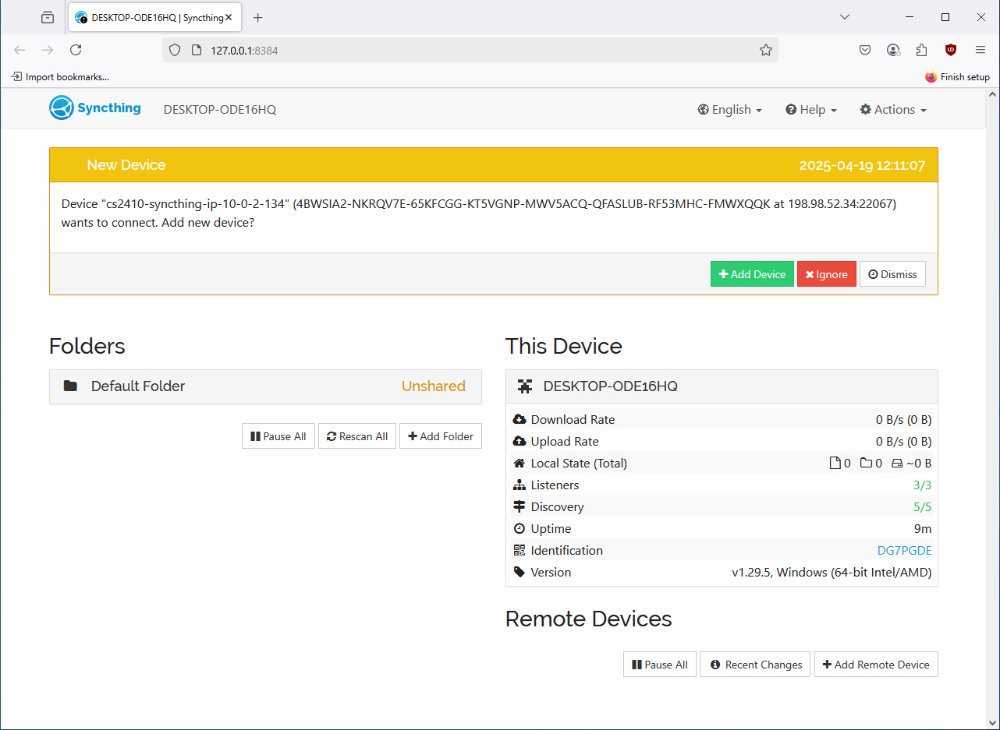

Add the device once you verify it is your ubuntu host based on the device ID. Add the folder(s) from your host. You will be able to select the folder location to synchronize with the host. Use absolute path. If the folder doesn’t exist it will be created. You now have folders synchronized between two computers.

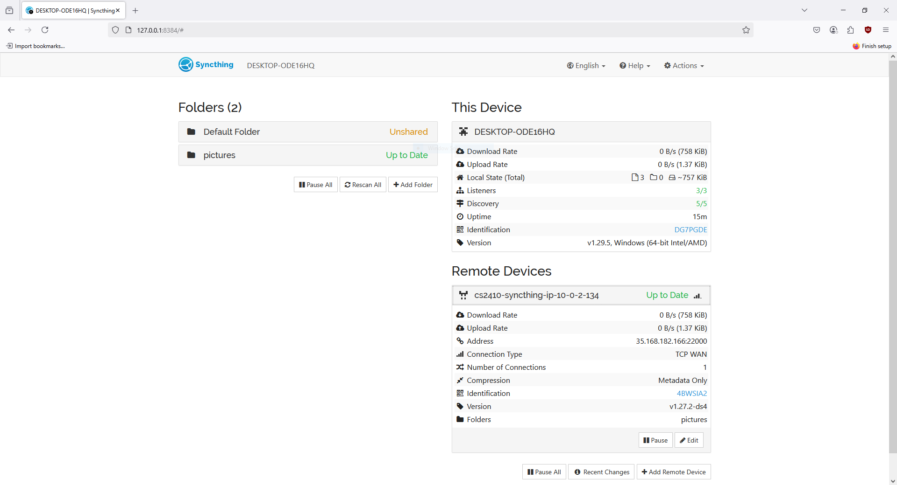

When a new picture was added to my Windows synchronized folder, it was uploaded to Ubuntu. When I removed a picture on Ubuntu it was removed from Windows. This happens within a few seconds of making changes on either system. Status of synchronization is available on all devices. It’s noticeable when synchronizing a lot of files or large files.

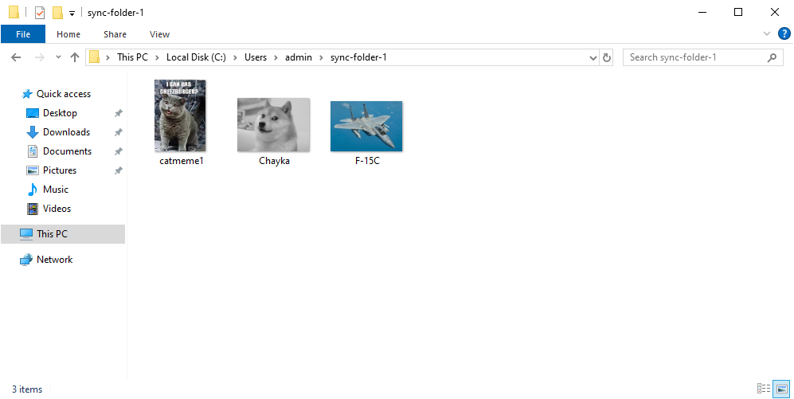

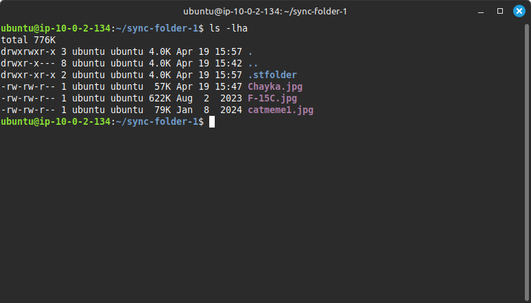

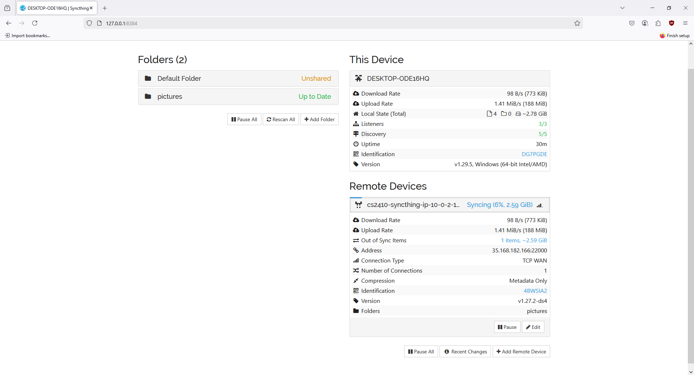

I added a MacBook Air M3 and it started synchronizing files.

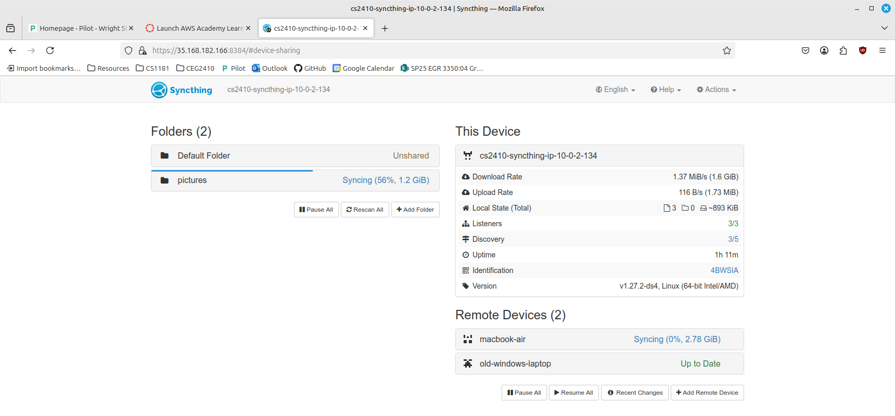

When running Syncthing on remote devices, use 127.0.0.1:8384 to connect to the web GUI.
You may see a hidden folder ".strfolder" or something similar in the synchronized folder on each system, do not delete this folder. It is used as part of the synchronization process.
<h3>Managing Users and Backups</h3>
Remote devices need to be added from the host device which can only be accomplished by someone with access to the Ubuntu instance. A user cannot initiate their own access. Once the synchronization is completed on their remote computer, any change the user makes to files in the synchronized folder will change the files on the host and every synchronized remote device. The configuration files can be backed up and restored but you would need to back up the configuration file on each computer. Use the command `syncthing -path` to display all critical files that should be backed up. The issue with restoring a configuration file is that if something isn't set up correctly on the host or any of the remote devices (i.e. a user renamed the synchronized folder) it could cause changes to propagate across all systems, and in the worst case all files could be removed. Care needs to be taken when restoring a backed up configuration file.<br>
<br>

Example config.xml file from Ubuntu AWS instance: [Link](config.xml)

<h3>Intended Use</h3>
Syncthing is not a backup solution and it is not a cloud based files server solution. There are specific applications that would much better serve those purposes than Syncthing. Syncthing does exactly what it advertises, synchronize files between computers. It is best used on a single network (i.e. a home environment) but can work across multiple networks when correctly configured. I wouldn't recommned using Syncthing to synchronize files for organizations with more that a handful of users, switch to a NAS solution for better control, management, and permissions. If you want to synchronize files on a laptop and a home pc so you can always work from the same file on either without relying on dropbox or a similar application, Syncthing works great. It is easy to set up and is free. It's a niche application but for that niche it works very well.
