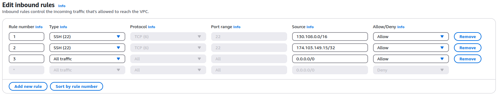
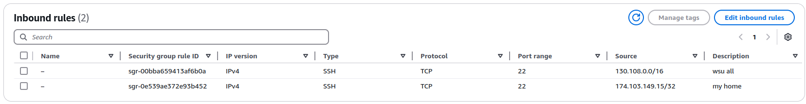
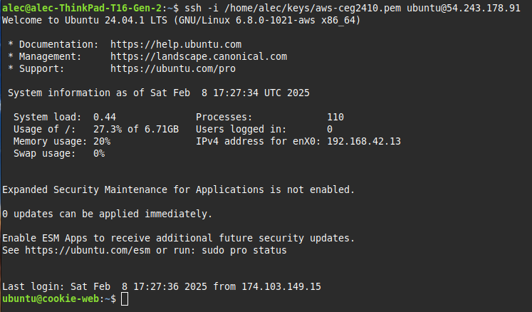
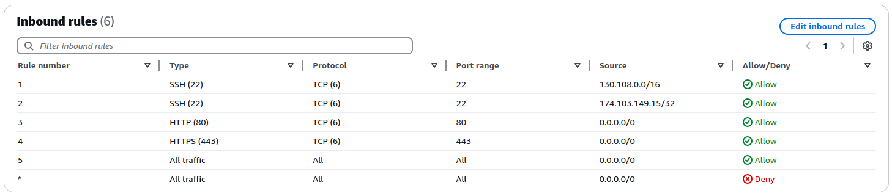
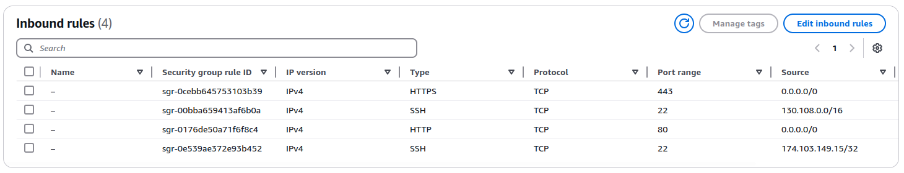
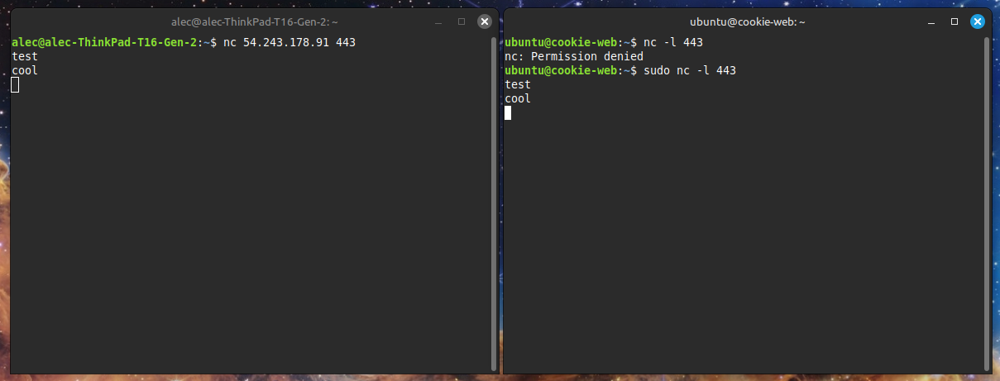
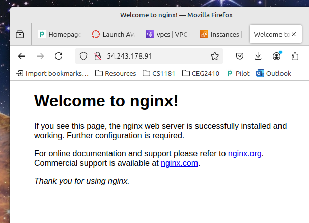

<h1>Task 1 - Firewall Configuration</h1>

<h2>Firewall Exception for Campus and Home Network</h2>

To access the cookie-server from home I created a network ACL inbound rule for the SSH protocol on prot 22.  SSH uses TCP which is a connection-oriented protocol that ensures a connection is established prior to any data being sent.  TCP also uses chechsums and sequencing to provide reliable data delivery.  It verifies the data was not changed during transmission using a checksum and sequencing allows the data to be reconstructed if it arrives out of order at the destination.  Internet Assigned Numbers Authority assigned SSH port 22.  

I added rule 1 and 2 to the network ACL rules.  Rule 1 allows connections from the OARnet IP ranges for which WSU belongs.  Rule 2 allows connections from my home IP address and only that single IP address.  

The default inbound and outbound rules were not changed.  The Security group rules described below will protect the network from unwanted visitors by providing a stateful SSH connection which is limited to IP address 130.108.0.0/16 and 174.103.149.15/32.

I added two inbound rules to the security group.  The first rule allows SSH connections from the OARnet IP address for which WSU belongs. The second rule allows a SSH connection from my home IP address.  

Because security groups are stateful, no outbound rules needed to be added.

After updating the firewall I tested the rules by connection from a computer in my home successfully via SSH.

<h2>Firewall Exception for HTTP and HTTPS</h2>

Allowing HTTP and HTTPS connections from any source requires adding rules to the security group.  Adding HTTP port 80 and HTTPS port 443 to the network ACL is not required but I tested both scenarios.  I decided to add HTTP on port 80 and HTTPS on port 443 to my network ACL.  To allow connections from any source I used the IP address 0.0.0.0/0.

Network ALC:

Security Groups:

<h2>Testing Connections</h2>

I'll use netcat to listen to incoming connections on my cookie-server through port 443 using the command `nc -l 443`.  I'll send a message to my cookie-server IP address and port number from my laptop using the command `nc 54.243.178.91 443`.  If the cookie-server is allowing connections on port 443 then any text I type on my laptop will appear in the cookie-server terminal.

I am able to send messages back and forth from my laptop and cookie-server via port 443 using netcat.  I can try the same with other ports not open and I won't be able to communicate between the two systems.  This demonstrates that port 443 is open and accepting connections.  I'll verify port 80 is working using my web browser.  My cookie-server has nginx running so I can connect to the default web page by entering the AWS elastic IP address into a browser `http://54.243.178.91/`.

