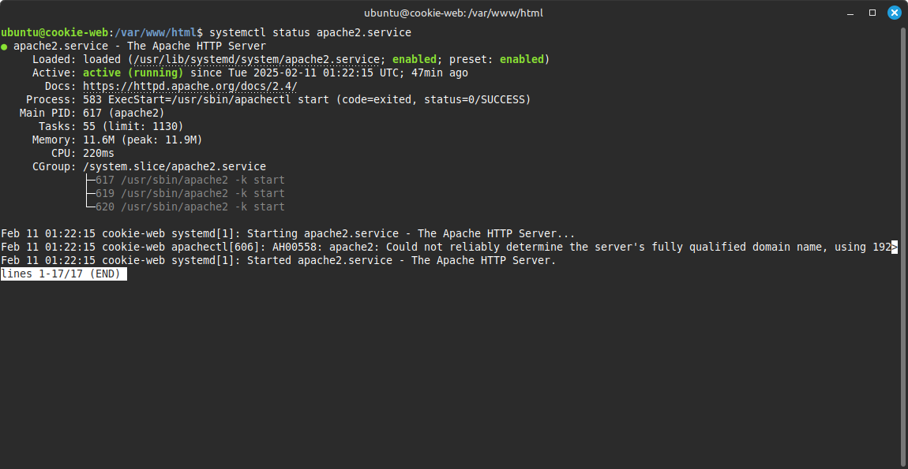
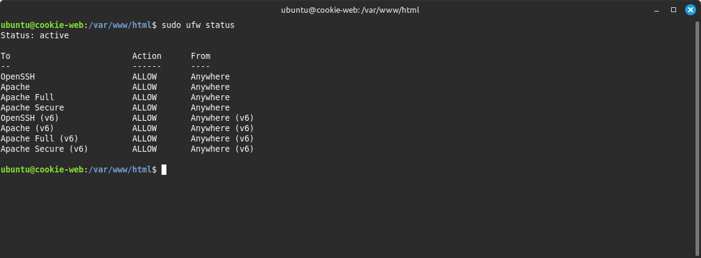
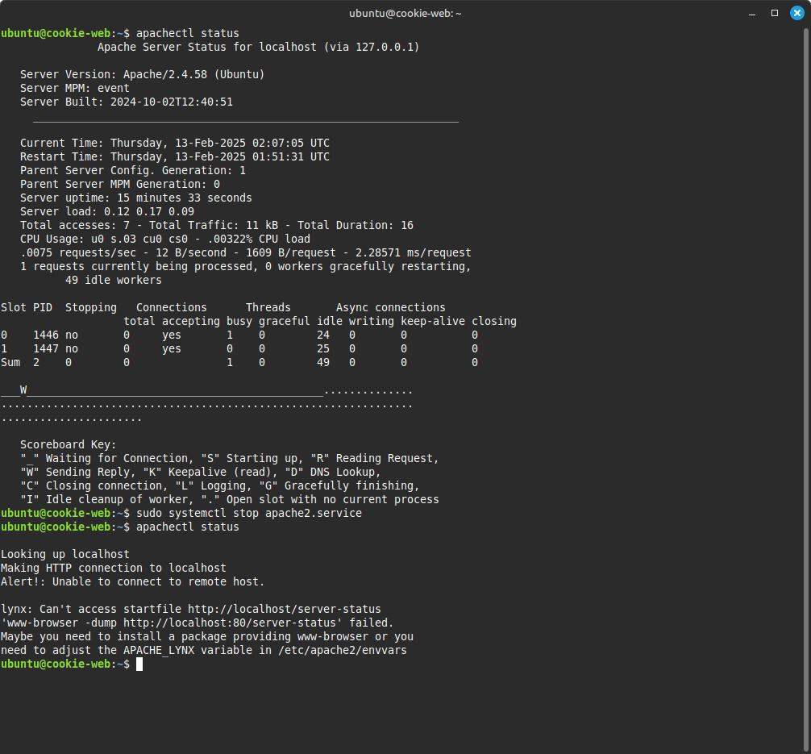
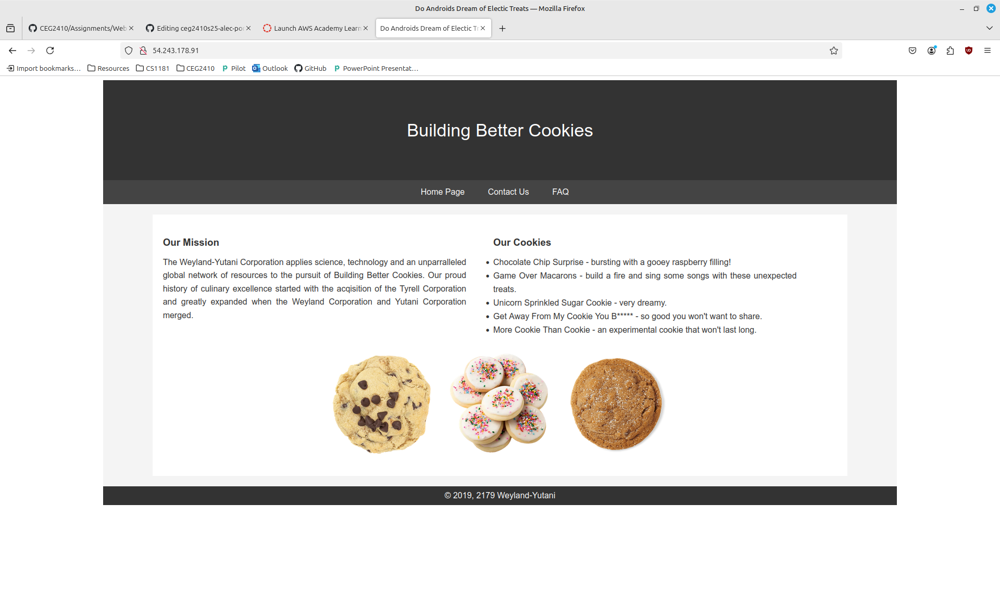

I installed apache `sudo apt install apache2` and verified the service was running `systemctl status apache2.service`.

I added ufw rules for apache: `sudo ufw allow 'Apache'`, `sudo ufw allow 'Apache Full'`, and `sudo ufw allow 'Apache Secure'` then checked the status with `sudo ufw status`.

I can control the service using systemctl and a variety of commands. For example, to stop the serve I run `sudo systemctl stop apache2.service` and to start it back up I run `sudo systemctl start apache2.service`.

The root directory for the web page is /var/www/html.  The main web page is titled index.html and other pages can be added using the .html extension.  I used css to define the style of my web page and stored the main.css file in /var/www/html/css.  All images are stored in /var/www/html/images.  To get the 404 page to work I added the line `ErrorDocument 404 /404.html` to the /etc/apache2/sites-enabled/000-default.conf file.  This tells apache I want a specific web page (404.html) that is located in apache's root directory (/) to display 404 error redirects.

Files can be added a variety of ways.  I can use wget to upload files from a web page or github, I can use sftp, or I can use scp.  I decided to use scp. I uploaded files from my laptop to the cookie server using the command `scp -i /home/alec/keys/aws-ceg2410.pem /home/alec/test.txt ubuntu@54.243.178.91:/home/ubuntu`.  This copies the file test.txt located in /home/alec to the folder /home/ubuntu on my cookie server.

I can verify my server is serving content by visiting the website from a remote system by browsing to http://54.243.178.91.  I can also verify it from the local system by browsing to http://localhost using curl.  The command `curl http://localhost` displays all of the http code or I can use the command `curl -I` to see just the header information.  If apache isn't serving content the curl command returns `curl: (7) Failed to connect to localhost port 80 after 0 ms: Couldn't connect to server.`  The third way I found to check if apache is serving content is to use `apachectl status`.  First I installed Lynx which is a text based browser then I ran `apachectl status` with the service running and after stoping the service.  If apache isn't serving content then the output from apachectl displays a message stating it couldn't connect.

 
 
 

Behold, the fourth most epic cookie web site ever: http://54.243.178.91/

