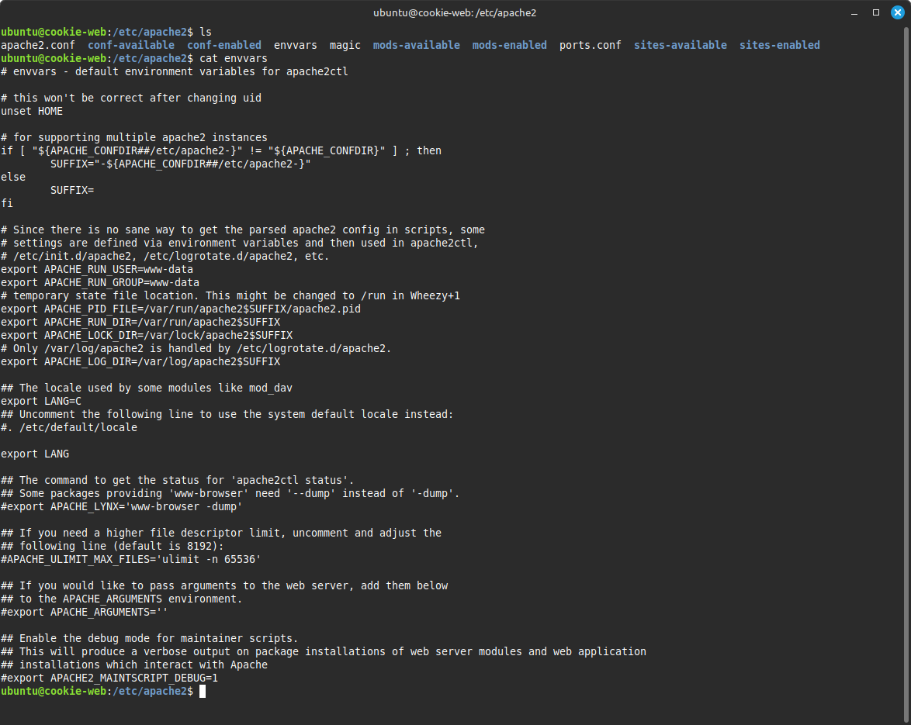
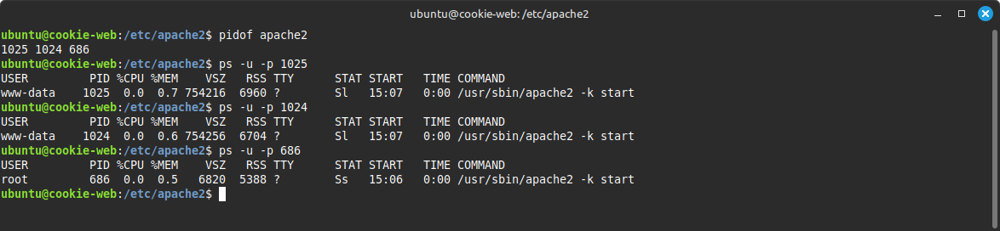
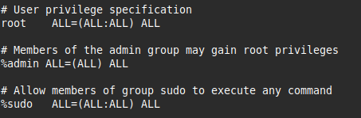
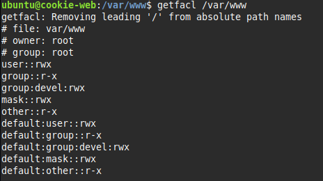
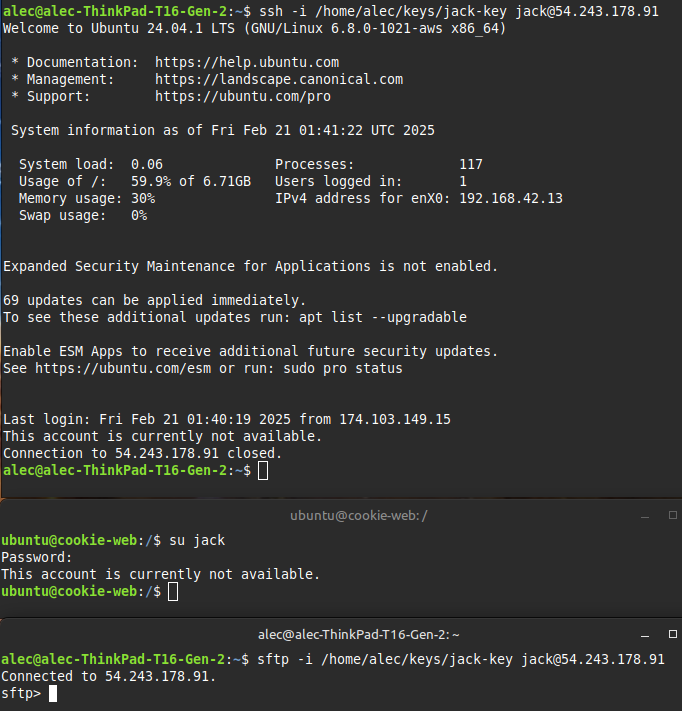

<h1>Alec Porter Task 3</h1>

The "username" utilized by the apache service is listed in the apache environmental variables file `/etc/apache2/envvars`.  

You can also find the process IDs for apache `pidof apache2` and then list details about those processes using `ps -u -p <process id>`.

The username is "www-data".

Administrators need full access to the system and there are a couple of ways do do this.  They can be added to the admin group or they can be added to the sudo group.  I can set privileges for individual users by editing the /etc/sudoers file.  I decided to not change the sudoers file but I found a useful website that give insight to the file and how to configure it (https://heshandharmasena.medium.com/explain-sudoers-file-configuration-in-linux-1fe00f4d6159).  I created a user called Jane and added her to the admin group `sudo useradd -g admin jane`.  Being a member of admin gives Jane that ability to run any command as all users on all hosts.  Sudo has slightly elevated privileges that give the ability to run any command as all users and all groups on all hosts.

Website developers need access to Apache configuration files and the website files at the following locations: /var/log/apache2, /etc/apache2, /var/www.  I created a developer group devel to manage permissions.  To give me greater flexibility in managing website developer permissions I decided to use ACLs.  ACLs allow me to add additonal user and group permissions to files and folder.

I then give the devel group read, write, and execution access to all files and folder in /var/www using the recursive flag `sudo setfacl -Rm g:devel:rwx /var/www`.  I created a second user and added them to the devel group.  Both users in the devel group can access and change files/folders in /var/www.  If I want any new files/folders to inherit ACL permissions I need to set a default ACL `sudo setfacl -dm g:devel:rwx /var/www`.  Alternatively I could use `sudo chown john:devel /var/www`.  This changes the user and group ownership to john (lead developer) and the devel group.  Any member of the devel group could modify files/folders.  Follow the same process (ACL or chmod) for /var/log/apache2 and /etc/apache2.

The root directory is editable by the site developers and readable by the apache service.

 

Write up for admins to add a new site developer: 

1. Add new user to devel group: `sudo useradd -g devel <username>` 
2. Set new user default password: `sudo passwd <username>` 
3. Force user to change password at next login: `sudo chage -d 0 <username>`
   
Any user added the devel group receives the permissions as outlined in the ACL.

 
 

Extra Credit Part 1

I set the default ACL on /var/www using `sudo setfacl -dm g:devel:rwx /var/www`.  The default ACL can only be set on a directory.  The default determines the permissions a file or directory inherits from its parent directory when the file or directory is created.   

Extra Credit Part 2

1. Created key pair for the user Jack who I wanted to restrict `ssh-keygen -t rsa`
2. Upload Jack's public key to the server and placed it in /home/jack/.ssh with the filename authorized_keys. Changed permissions on the key `sudo chmod 600 authorized_keys`
3. I added /usr/sbin/nologin to /etc/shell.  I disabling jack's shell access `sudo chsh -s /usr/sbin/nologin jack` then restarted the service.
4. I successfully connected to jack's account using sftp and his private key `sftp -i /home/alec/keys/jack-key jack@54.243.178.91`. I was able to create a new folder and delete it using sftp.  I could not connect via ssh or su into Jack's acocunt. 

