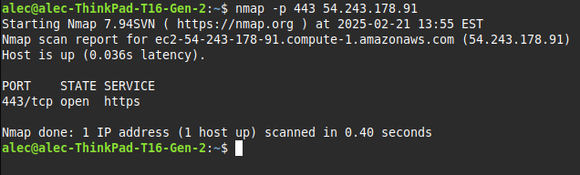

<h1>Alec Porter Task 4</h1>

My first step was to create SSL certificate and key:
`sudo openssl req -x509 -nodes -days 365 -newkey rsa:2048 -keyout /etc/ssl/private/apache-selfsigned.key -out /etc/ssl/certs/apache-selfsigned.crt`
This adds the private key to /etc/ssl/private and the certificate to /etc/ssl/certs.

Next I created an apache configuration snippet with strong encryption settings by creating ssl-params.conf in /etc/apache2/conf-available.  I used the settings provided in https://cipherlist.eu/ and copied them to ssl-params.conf.

I edited the default-ssl.conf file in /etc/apache2/sites-available.  I added a Servername and changed the DocumentRoot to the folder where my cookieserver website is located.  I also updated the SSLCertificateFile and SSLCertificateKeyFile to the locations of they key and cert created in the first step. 

The next step was to verify the firewall would allow https traffic through.  I already adjusted firewall settings when I first installed apache and `sudo ufw status` verified the firewall was correctly configured.

With everything configured I enabled all of the changes in apache and restarted the service: `sudo a2enmod ssl`,`sudo a2enmod headers`, `sudo a2ensite default-ssl`, `sudo a2enconf ssl-params`, and `sudo systemctl restart apache2`.

The third step was to check to see if the secure site works.  navigated to https://54.243.178.91 and I got a warning:

I accepted and viewed the site certificate:

This verifies the server is serving content over HTTPS.  A secondary way is to use nmap to see if port 443 is open.

The final step was to redirect http requests to https.  I added Redirect "/" "https://54.243.178.91/" to the default configuration file for the http server.  After restarting the service I verified typing http://54.243.178.91 redirected to https://54.243.178.91.

No additional moduels were required for the apache service to use SSL.  If anything was required I must have set it up earlier in the semester when getting apache and the firewall set up and configured.
