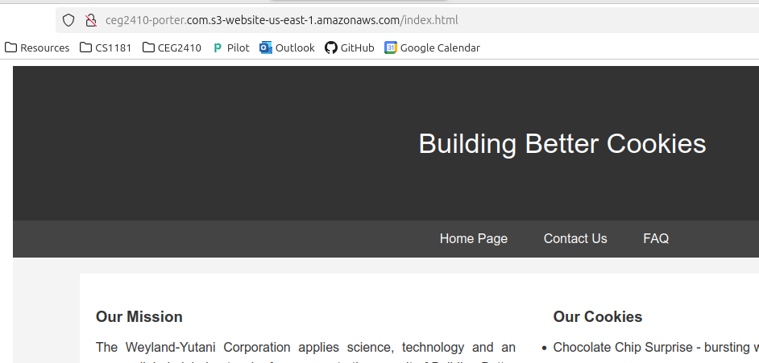
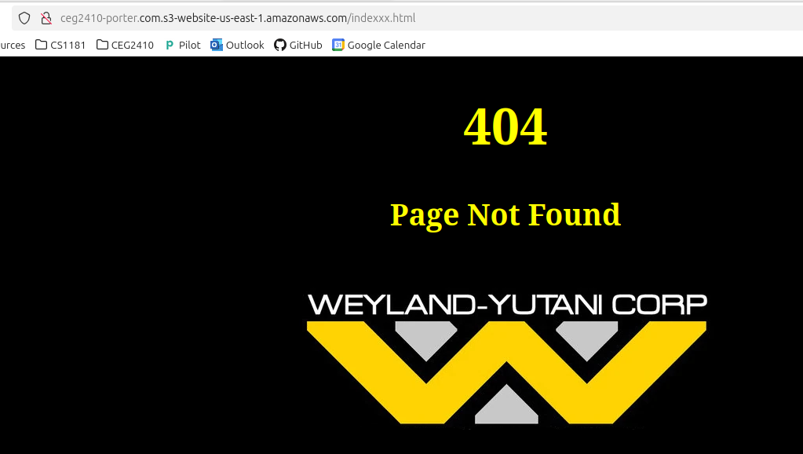

<h1>Alec Porter Task 6</h1>
<br>
Used the following guide: https://docs.aws.amazon.com/AmazonS3/latest/userguide/HostingWebsiteOnS3Setup.html<br>
<br>
Created a bucket titled ceg2410-porter.com.<br>
Uploaded the files for my cookie website to s3://ceg2410-porter.com.<br>
Edited static webhosting and added index document location and 404 error page location.<br>
Defined the permissions policy as follows:

```
{
	"Version": "2012-10-17",
	"Statement": [
		{
			"Sid": "PublicReadGetObject",
			"Effect": "Allow",
			"Principal": "*",
			"Action": "s3:GetObject",
			"Resource": "arn:aws:s3:::ceg2410-porter.com/*"
		}
	]
}
```

Followed the rest of the steps in the guide and the website home page and 404 page worked without issue.<br>




<br>
Amazon provides guides to route DNS traffic to your website bucke:
https://docs.aws.amazon.com/Route53/latest/DeveloperGuide/getting-started-s3.html#getting-started-create-alias (starting at setp 10). <br>
<br>
<br>
There are several different ways to enable HTTPS for your static website but they all require an additional Amazon service. According to Amazon.com:<br>
"Amazon S3 website endpoints do not support HTTPS or access points. If you want to use HTTPS, you can do one of the following:
(Recommended) Use AWS Amplify Hosting to host static website content stored on S3. Amplify Hosting is a fully managed service that makes it easy to deploy your websites on a globally available content delivery network (CDN) powered by Amazon CloudFront, allowing secure static website hosting. <br>
With AWS Amplify Hosting, you can select the location of your objects within your general purpose bucket, deploy your content to a managed CDN, and generate a public HTTPS URL for your website to be accessible anywhere. For more information about Amplify Hosting, see Deploying a static website to AWS Amplify Hosting from an S3 general purpose bucket and Deploying a static website from S3 using the Amplify console in the AWS Amplify Console User Guide.<br>
Use Amazon CloudFront to serve a static website hosted on Amazon S3. For more information, see How do I use CloudFront to serve HTTPS requests for my Amazon S3 bucket? To use HTTPS with a custom domain, see Configuring a static website using a custom domain registered with Route 53."<br>
<br>
Tutorial for using AWS Amplify: https://docs.aws.amazon.com/AmazonS3/latest/userguide/website-hosting-amplify.html<br>
Tutorial for using CloudFront: https://docs.aws.amazon.com/AmazonCloudFront/latest/DeveloperGuide/getting-started-secure-static-website-cloudformation-template.html<br>
Another tutorial for using CloudFront: https://repost.aws/knowledge-center/cloudfront-https-requests-s3<br>
<br>
I couldn't find alternatives to those Amazon services, the guides online I found were built around CloudFront.
The one resource I found that showed configuring your static site to use SSL didn't work for me: https://www.geeksforgeeks.org/how-to-configure-ssl-for-amazon-s3-bucket/ so it looks like CloudFront or AWS Amplify may be the only options for HTTPS.
