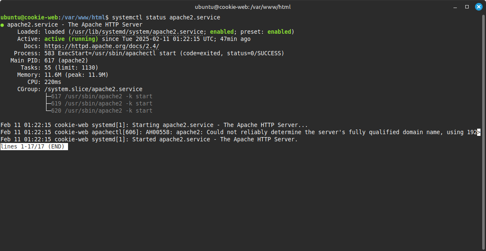
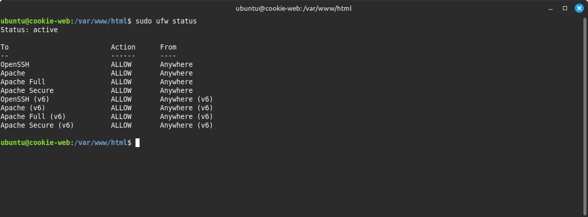

I installed apache `sudo apt install apache2` and verified the service was running `systemctl status apache2.service`.

I added ufw rules for apache: `sudo ufw allow 'Apache'`, `sudo ufw allow 'Apache Full'`, and `sudo ufw allow 'Apache Secure'` then checked the status with `sudo ufw status`.

I can control the service using systemctl and a variety of commands. For example, to stop the serve I run `sudo systemctl stop apache2.service`.

The root directory for the web page is /var/www/html.  The main web page is titled index.html and other pages can be added using the .html extension.  I used css to define the style of my web page and stored the main.css file in /var/www/html/css.  All images are stored in /var/www/html/images.  Files can be added a variety of ways.  I can use wget to upload files from a web page or github. I should be able to use SCP to upload files but I keep getting an error and I have not figured out why.

