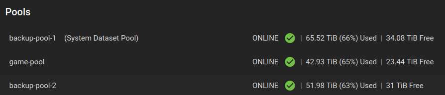

<h1>Alec Porter Personal Backups Report</h1> 

<h2>Type of data that I value backing up</h2> 

All of it... 

I assign data different value based on the type of data, if it's something I can recreate, and the time and effort to recreate it. 

<ul>
<li>I have personal data that is critical and I can’t recreate.  That includes military retirement data, medical files, taxes, some financial data, etc.</li>
<li>I have personal data this is critical and I can recreate.  That includes some financial data, contacts, etc.</li>
<li>I have school data that is critical and I can’t recreate or would take a long time to recreate.  That included labs, projects, slides from old classes. etc.</li>
<li>I have school data that is critical and I can recreate it.  That includes slides from current classes, etc.</li>
<li>I have personal data that is non-critical and I can recreate.  That includes a home inventory, etc.</li>
<li>I have school data that is non-critical and I can recreate.  That includes info about Wright State and the Cyber Security program.</li>
<li>I have other non-critical data that I can recreate but is time intensive.  That includes my Steam library, DVD/Bluray rips, etc.</li>
<li>I have other non-critical data that I can recreate but is not time intensive.  Programs, bookmarks, etc.</li>
</ul>
 
<h2>Give an approximation (in size) to your total data backup needs.</h2>
This is fairly straightforward for me.  My backup server currently has 160.5TiB of data.  Factoring in room for growth I would estimate 200TiB in backup needs.  

 
<h2>Describe what you are currently doing for backups.</h2>

All of my data is backed up to a local backup server.  The backup server is running TrueNAS Core with a total capacity of ~248TiB.  There are three pools of data.  Each pool is comprised of hard drives in RaidZ2 (equivalent to Raid 6) configurations.  The hardware runs the ZFS file system and uses enterprise grade NAS drives, a Xeon processor, and ECC memory for maximum data protection and resilience.  The backup server only runs when backing up and recovering data, the majority of the time the server is turned off. 
 
Backup Server Dashboard:

In addition to the backup server I have a type I hypervisor that runs 24X7.  It runs several VMs including a TrueNAS Scale server. This sever is primarily a media server but it also stores a set of backup files, acts as a local cloud storage system, and syncs files between computers.
Primary Server Dashboard:

The primary server has ~181TiB of storage.  All critical data and media is stored on this system but it doesn't store my game libraries. 
Because this server runs 24X7 I use it to sync critical data between my laptop, two desktops, and the server itself.  This means my critical data is on 5 different systems, four of which are synced in real time.  I also back up critical data on an external SSD and store it in a fire safe.  The external SSD and backup server lag the real time data synced systems.  I try to update the SSD monthly but that's hit or miss.  I only copy new data to the backup server when I have complied a lot of data (usually when I approach 1 TB of new data).  The syncing software I use keeps my critical data synced and backed up in real time while I manually backup non-criitcal data as needed. 
 
<h2>Describe your backup resolution (plan to implement) to meet 3-2-1 backup "rule" standards.</h2> 
The two areas of improvement for my implementation is to use encryption and find an off-site backup solution.  
Files on the external SSD aren’t encrypted.  The synced critical files are protected on each file system using permissions but they are not encrypted.  ZFS has encryption built into the file system but I haven’t been using it.  I decided to enable it for the critical data.  That required me creating a new dataset with encryption and copying all my critical data into that encrypted dataset.  I now have the ability to lock and unlock access to that dataset (i.e. encrypt/decrypt).  

I need to look into options to encrypt data on the external SSD and the systems that sync data. 

I have no external backup solution.  I don’t need anywhere near the 200TiB because most of that is media, games, ect. that can recreated given time.  My critical files only occupy ~50GiB of data so an exeranl backup solution will be inexpensive.  100GB of Amazon S3 is $2.30 per month or $2.00 per month for Google Drive.

